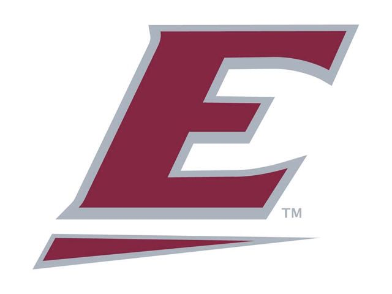

# Congratulations on being accepted!! 

In this project, I wil mark up a letter that will be hosted on the Eastern Kentucky University intranet. The letter is a response from one of the administrative heads to a student (me) in the Data Science masters program concerning their (my) application to the university. 

Project is base on: https://developer.mozilla.org/en-US/docs/Learn/HTML/Introduction_to_HTML/Marking_up_a_letter

## Skills Showcased:
- Basic and Advanced HTML text formatting
- CSS

(#)
